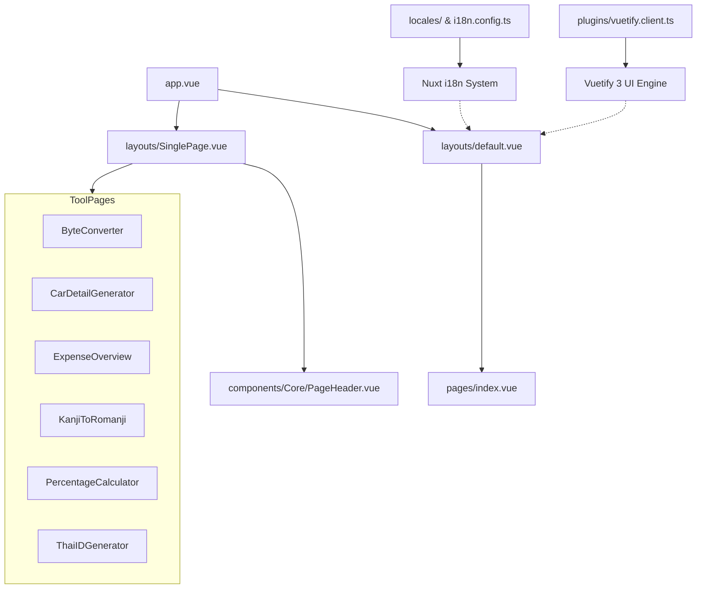

# Zepia Playground

Welcome to **Zepia Playground**—a multi-utility toolbox application built using [Nuxt 3](https://nuxt.com/) and [Vuetify 3](https://vuetifyjs.com/). The project is optimized as a Static Site Generated (SSG) web application to be hosted directly on [GitHub Pages](https://zepiawork.github.io/).

---

## 🛠️ Tech Stack

*   **Framework**: [Nuxt 3](https://nuxt.com/) (Vue 3, Vue Router, Nitro Server Engine)
*   **UI Library**: [Vuetify 3](https://vuetifyjs.com/) (with custom color palettes and material icons)
*   **Localization (i18n)**: [@nuxtjs/i18n](https://i18n.nuxtjs.org/) (supports English, Thai, Japanese, and German)
*   **Transliteration Engine**: [Kuroshiro](https://github.com/dodo/kuroshiro) & [Kuromoji Analyzer](https://github.com/takuyaa/kuromoji.js) (for Kanji-to-Romaji translations)
*   **Styling & Fonts**: Vanilla CSS variables with custom `InterVariable` typography
*   **Static Hosting**: Optimized static preset (`static`) using Nitro for deployment to GitHub Pages

---

## 📂 Project Directory Structure

Below is the directory tree of the workspace:

```text
zepiawork.github.io/
├── .github/                 # GitHub Action workflows for CI/CD deployment
├── assets/                  # CSS stylesheets and fonts
│   ├── css/
│   │   ├── fonts.css        # Font faces for variable typography
│   │   └── main.css         # Global reset and page layout transitions
│   └── fonts/
│       ├── Inter-VariableFont.ttf
│       └── Inter-Italic-VariableFont_opsz,wght.ttf
├── components/              # Vue shared components
│   └── Core/
│       ├── Menu/
│       │   └── Layout.vue   # Reserved menu layout component
│       └── PageHeader.vue   # Standard navigation header with home button
├── interface/               # TypeScript type and interface definitions
│   └── MenuItem.ts          # MenuItem interface definition
├── layouts/                 # Page layout wrappers
│   ├── default.vue          # Primary wrapper containing theme/locale configurations
│   └── SinglePage.vue       # Minimal layout for tool pages with back navigation
├── locales/                 # Localization dictionaries
│   ├── de.json              # German (Deutsch) translation dictionary
│   ├── en.json              # English translation dictionary
│   ├── ja.json              # Japanese (日本語) translation dictionary
│   └── th.json              # Thai (ไทย) translation dictionary
├── pages/                   # Application routes & utility tool pages
│   ├── ByteConverter.vue    # Data storage size unit converter (Bytes to Terabytes)
│   ├── CarDetailGenerator.vue # Randomized VIN & Engine number generator
│   ├── ExpenseOverview.vue  # Proportional box visualizer budget utility
│   ├── index.vue            # Dashboard hub / homepage listing all tools
│   ├── KanjiToRomanji.vue   # Japanese Kanji to Romaji translation page
│   ├── PercentageCalculator.vue # Multi-functional percentages calculator
│   └── ThaiIDGenerator.vue  # Check-digit-validated Thai Citizen ID generator & validator
├── plugins/                 # Nuxt client plugins
│   └── vuetify.client.ts    # Vuetify initialization and custom color palettes
├── public/                  # Static asset files
├── server/                  # Server-side configurations
│   └── tsconfig.json        # TypeScript configuration rules for Nitro endpoints
├── app.vue                  # Primary application shell
├── eslint.config.mjs        # ESLint flat code linting configurations
├── global.d.ts              # Global environment type declarations
├── i18n.config.ts           # Nuxt i18n configurations
├── nuxt.config.ts           # Main configuration file for Nuxt
├── package.json             # Project meta, scripts, and npm dependencies
└── tsconfig.json            # Main configuration for compiler TypeScript
```

---

## 🗺️ Architectural Mapping



---

## 📑 Core Utilities & Tools Description

### 1. 🏠 Homepage Dashboard (`pages/index.vue`)
*   **Path**: [pages/index.vue](file:///f:/Work/zepiawork.github.io/pages/index.vue)
*   **Description**: Serves as the navigation hub displaying links to all utility pages as custom-styled cards with icons.

### 2. 🧮 Percentage Calculator (`pages/PercentageCalculator.vue`)
*   **Path**: [pages/PercentageCalculator.vue](file:///f:/Work/zepiawork.github.io/pages/PercentageCalculator.vue)
*   **Description**: Features a multi-tab panel for calculations including:
    *   What percent is $X$ of $Y$?
    *   Adding $X\%$ to a number.
    *   Subtracting $X\%$ from a number.
    *   What is $X\%$ of $Y$?
    *   Percentage change from $X$ to $Y$ (styled dynamically to show green/red colors for increase/decrease).

### 3. 💾 Byte Unit Converter (`pages/ByteConverter.vue`)
*   **Path**: [pages/ByteConverter.vue](file:///f:/Work/zepiawork.github.io/pages/ByteConverter.vue)
*   **Description**: Live unit converter mapping values between `Bytes`, `Kilobytes`, `Megabytes`, `Gigabytes`, and `Terabytes` using binary power base multipliers ($1024^n$).

### 4. 🚗 Car Detail Generator (`pages/CarDetailGenerator.vue`)
*   **Path**: [pages/CarDetailGenerator.vue](file:///f:/Work/zepiawork.github.io/pages/CarDetailGenerator.vue)
*   **Description**: Generates randomly formatted, realistic Vehicle Identification Numbers (VIN / Chassis Number) and Engine Numbers using selectable rules (manufacturer, manufacturing year, engine type, engine displacement).

### 5. 🪪 Thai ID Card Generator & Validator (`pages/ThaiIDGenerator.vue`)
*   **Path**: [pages/ThaiIDGenerator.vue](file:///f:/Work/zepiawork.github.io/pages/ThaiIDGenerator.vue)
*   **Description**: Generates real, validation-compliant Thai Citizen Identification Numbers based on selected provinces and formats (formatted with dashes or plain numbers). Includes a validator module checking length, format, and check-digit compliance using mathematical checksum validation.

### 6. 📊 Expense Proportional Overview (`pages/ExpenseOverview.vue`)
*   **Path**: [pages/ExpenseOverview.vue](file:///f:/Work/zepiawork.github.io/pages/ExpenseOverview.vue)
*   **Description**: A budget tracking visualization tool. Items are represented by colored cards whose surface areas are scaled proportionally to represent their share of the total budget. Supports toggling between monthly and yearly cycles (automatically scaling amounts by $12\times$ or $/12$ where required).

### 7. 💮 Japanese Kanji to Romaji Translator (`pages/KanjiToRomanji.vue`)
*   **Path**: [pages/KanjiToRomanji.vue](file:///f:/Work/zepiawork.github.io/pages/KanjiToRomanji.vue)
*   **Description**: Utilizes the `Kuroshiro` library with a `Kuromoji` dictionary engine fetched from a CDN to transliterate Japanese Kanji, Hiragana, and Katakana texts into spaced Romaji writing.

---

## 🎨 Global Layout & Configurations

*   **Primary Layout ([layouts/default.vue](file:///f:/Work/zepiawork.github.io/layouts/default.vue))**: Wraps pages and hosts a settings cog interface. The cog triggers a dialog permitting users to dynamically swap theme variants and switch between languages.
*   **Vuetify Plugin ([plugins/vuetify.client.ts](file:///f:/Work/zepiawork.github.io/plugins/vuetify.client.ts))**: Sets up client-side rendering for Vuetify. Registers five color theme palettes:
    1.  `light` (Default Light)
    2.  `dark` (Default Dark)
    3.  `red` (Warm Red Theme)
    4.  `green` (Soft Green Theme)
    5.  `blue` (Professional Blue Theme)
*   **Localization Dictionaries ([locales/](file:///f:/Work/zepiawork.github.io/locales))**: Holds JSON key-value translation pairs to support complete UI translations for all 4 supported languages.

---

## ⚙️ Development Commands

Within the project root, you can run the following package scripts:

| Command | Action |
| :--- | :--- |
| `npm run dev` | Runs the local development server at `http://localhost:3000` with HMR. |
| `npm run build` | Builds the application bundle. |
| `npm run generate` | Generates a static HTML build of pages (SSG) in the `.output/public` folder. |
| `npm run preview` | Runs a local server to preview the generated static production build. |
| `npm run lint` | Inspects code files for syntax issues using ESLint. |
| `npm run lint:fix` | Automatically fixes simple syntax linting issues. |
| `npm run typecheck` | Compiles typescript files in diagnostic non-emitting mode to check for errors. |
