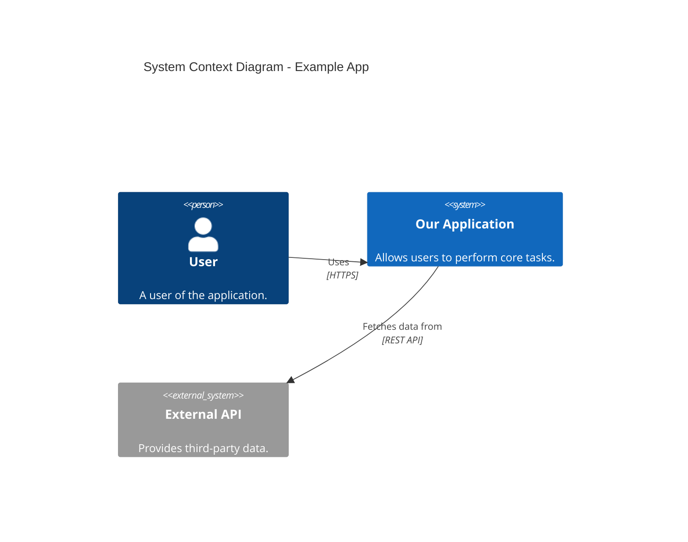

# Architectural Standards & Guidelines

As a Senior Software Architect, I have established the following standards to ensure our codebase remains maintainable, scalable, and robust. All AI assistants (including Gemini) and human developers must adhere to these guidelines when working on this project.

## 1. Clean Code Principles

Clean code is the foundation of a maintainable project. Follow these core principles:

- **Meaningful Names:** Use intention-revealing names for variables, functions, and classes. Avoid abbreviations and single-letter variables unless they are standard loop counters.
- **Functions Should Do One Thing:** Keep functions small and focused on a single responsibility. If a function is doing multiple things, extract them into helper functions.
- **DRY (Don't Repeat Yourself):** Avoid code duplication. Extract reused logic into shared utility functions, components, or services.
- **KISS (Keep It Simple, Stupid):** Avoid overly complex abstractions. Choose the simplest solution that works.
- **YAGNI (You Aren't Gonna Need It):** Do not implement features or abstractions for hypothetical future use cases. Build only what is needed now.
- **SOLID Principles:** Follow Single Responsibility, Open/Closed, Liskov Substitution, Interface Segregation, and Dependency Inversion principles where applicable, particularly in object-oriented components.
- **Fail Fast:** Validate inputs and states early. Throw meaningful errors instead of failing silently later in execution.

## 2. TypeScript Best Practices

TypeScript is our primary language. Strict typings are mandatory to catch errors at compile-time.

- **Strict Mode:** TypeScript `strict` mode must be enabled in `tsconfig.json`. Ensure `noImplicitAny`, `strictNullChecks`, etc., are active.
- **Never use `any`:** Avoid `any` completely. Use `unknown` if the type is truly unknown, and narrow it down using type guards.
- **Interfaces over Types:** Use `interface` for defining object shapes and contracts. Use `type` aliases for unions, intersections, and primitives.
- **Avoid Enums:** Prefer string literal union types (`type Status = 'active' | 'inactive'`) or immutable objects (`as const`) over standard TypeScript `enum`s, as they produce cleaner transpiled JavaScript and are more predictable.
- **Readonly by Default:** Use `readonly` for object properties and `ReadonlyArray` for arrays when data shouldn't be mutated.
- **Utility Types:** Make heavy use of TypeScript utility types like `Partial<T>`, `Pick<T, K>`, `Omit<T, K>`, and `Record<K, V>` to avoid redefining types.
- **Explicit Return Types:** Always explicitly define the return types of functions, particularly exported ones, to prevent unintended type inference changes.

## 3. C4x Diagramming Standards

When designing or documenting systems, we adhere to the **C4 model** to ensure clear, tiered communication of our architecture.

- **Level 1: System Context Diagram:** Shows the software system we are building and how it fits into the world in terms of the people who use it and the other software systems it interacts with.
- **Level 2: Container Diagram:** Zooms into the software system, showing the high-level technical building blocks (containers like web apps, single-page apps, desktop apps, databases, microservices) and how they communicate.
- **Level 3: Component Diagram:** Zooms into an individual container to show the components inside it. Maps logical components to the application structure (e.g., controllers, services, repositories).
- **Level 4: Code Diagram:** (Used sparingly) Zooms into an individual component to show how it is implemented as code (e.g., class diagrams or ER diagrams). Only use when the logic is exceptionally complex.

**Documentation Requirement:** When introducing a new major system or significant container, update or generate the corresponding C4 diagrams using Mermaid.js syntax in our architecture documentation.

Example Mermaid C4 System Context:

## 4. Workflow & Review Process

- **Test-Driven Thinking:** Consider how a component will be tested before writing it. Write pure functions and decoupled side-effects to ease unit testing.
- **Self-Documenting Code:** Write code that explains itself. Use comments to explain *why* (business logic, edge cases), not *what* or *how* (the code should make that obvious).
- **Consistent Formatting:** Rely on Prettier and ESLint for formatting. Do not argue over styling; let the automated tools enforce the rules.
